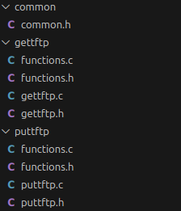
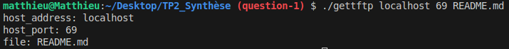

# TP2_Synthese

## 0. INTRUCTIONS

### Documentation utile

- [RFC1350](https://tools.ietf.org/html/rfc1350) : TFTP v2
- [RFC2347](https://datatracker.ietf.org/doc/html/rfc2347) : TFTP Option Extension
- [RFC2348](https://datatracker.ietf.org/doc/html/rfc2348) : TFTP Blocsize Option
- [RFC2349](https://datatracker.ietf.org/doc/html/rfc2349) : TFTP timeout & tsize options
- [RFC7440](https://datatracker.ietf.org/doc/html/rfc7440) : TFTP Windowsize Option  

## 1. QUESTION 1

Comme on fait 2 programmes avec le même départ, on créé un fichier header commun `common.h` contenant toutes les variables/macros/etc. et les librairies communes aux deux programmes.
Ce fichier est include dans tous les headers des programmes respectifs.

```c title="common.h"
#include <sys/types.h>
#include <sys/socket.h>
#include <netdb.h>
#include <unistd.h> 
#include <stdio.h>
#include <stdlib.h>
#include <string.h>
#define MAX_ARGUMENT 4
#define MIN_ARGUMENT 3
#define TRUE 1
#define FALSE 0
```
*common.h*


Par la suite, on créé les 2 fichiers `.c` par programme (et leur headers associés), pour obtenir la structure suivante :



les fichies `gettftp.c` et `puttftp.c` contiennent leur mains respectifs et verifient qu'on entre le bon nombre de paramètre et nous affiche les paramètres que nous entrons 

```c title="gettftp.c/puttftp.c"
int main(int argc, char *argv[]) { 
    char * host_address = argv[1];
    char * host_port = argv[2];
    char * file = argv[3];

    if (argc < MIN_ARGUMENT || argc > MAX_ARGUMENT) {
        fprintf(stderr,"Wrong number of arguments for %s", argv[0]);
        exit(EXIT_FAILURE);
    }
    printf("host_address: %s\n", host_address);
    printf("host_port: %s\n", host_port);
    printf("file: %s\n", file);

    return EXIT_SUCCESS;
}
``` 
*gettftp.c/puttftp.c*

Lorsqu'on lance la commande 

```bash ./gettftp localhost 69 README.md```

on obtient le résultat suivant :



Ce qui est statisfaisant ! On peut donc continuer à coder.

## QUESTION 2

On sait qu'on est capable de lire correctement les arguments d'entéen, on va donc retirer les printf qui n'étaient là que pour démontrer que nous pouvions bien lire les arguments.

