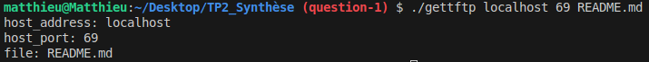
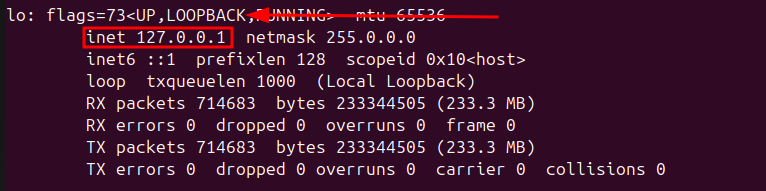
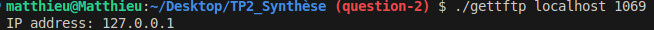
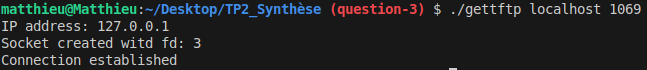
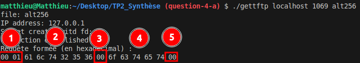
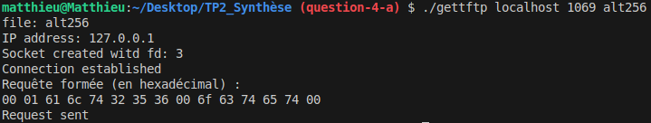
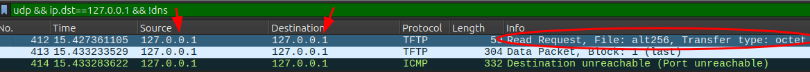

# TP2_Synthese

## 0. INTRUCTIONS

### Documentation utile

- [RFC1350](https://tools.ietf.org/html/rfc1350) : TFTP v2
- [RFC2347](https://datatracker.ietf.org/doc/html/rfc2347) : TFTP Option Extension
- [RFC2348](https://datatracker.ietf.org/doc/html/rfc2348) : TFTP Blocsize Option
- [RFC2349](https://datatracker.ietf.org/doc/html/rfc2349) : TFTP timeout & tsize options
- [RFC7440](https://datatracker.ietf.org/doc/html/rfc7440) : TFTP Windowsize Option  

## 1. QUESTION 1

Comme on fait 2 programmes avec le même départ, on créé un fichier header commun `common.h` contenant toutes les variables/macros/etc. et les librairies communes aux deux programmes.
Ce fichier est include dans tous les headers des programmes respectifs.

```c title="common.h"
#include <sys/types.h>
#include <sys/socket.h>
#include <netdb.h>
#include <unistd.h> 
#include <stdio.h>
#include <stdlib.h>
#include <string.h>
#define MAX_ARGUMENT 4
#define MIN_ARGUMENT 3
#define TRUE 1
#define FALSE 0
```
*common.h*


Par la suite, on créé les 2 fichiers `.c` par programme (et leur headers associés), pour obtenir la structure suivante :


les fichies `gettftp.c` et `puttftp.c` contiennent leur mains respectifs et verifient qu'on entre le bon nombre de paramètre et nous affiche les paramètres que nous entrons 

```c title="gettftp.c/puttftp.c"
int main(int argc, char *argv[]) { 
    char * host_address = argv[1];
    char * host_port = argv[2];
    char * file = argv[3];

    if (argc < MIN_ARGUMENT || argc > MAX_ARGUMENT) {
        fprintf(stderr,"Wrong number of arguments for %s", argv[0]);
        exit(EXIT_FAILURE);
    }
    printf("host_address: %s\n", host_address);
    printf("host_port: %s\n", host_port);
    printf("file: %s\n", file);

    return EXIT_SUCCESS;
}
``` 
*gettftp.c/puttftp.c*

Lorsqu'on lance la commande 

```bash ./gettftp localhost 69 README.md```

on obtient le résultat suivant :



Ce qui est statisfaisant ! On peut donc continuer à coder.

## QUESTION 2

On sait qu'on est capable de lire correctement les arguments d'entéen, on va donc retirer les printf qui n'étaient là que pour démontrer que nous pouvions bien lire les arguments.

Etant donné que récuprer les infos du serveur se fait dans les 2 programme, je vais coder ce dernier dans un fichier `common.c`. Pour m'assurer que ce dernier est correctement inlcude, j'ajoute les gardes fous habituels dans les headers (`#ifndef FILE_H` et `#define FILE_H` en terminant le fichier par `#endif`.)

Pour utiliser `getaddrinfo`, on doit créer une structure `addrinfo` qui contiendra les informations du serveur (`result`), ainsi qu'un filtre (`filter`) ainsi qu'un pointeur (`pointer`) pour parcourir la liste chainée `result`. Voici donc le prototype de la fonction `get_servers_infos` :

```c title="common.h"
int get_servers_infos(char * host_address,char * host_port, struct addrinfo ** result_infos);
```
*common.h*

La fonction retourne le status de sortie de `getaddrinfo` et modifie le buffer `result_infos` qui contiendra les informations du serveur.
L'utilisation d'un `addrinfo **` permet de modifier le pointeur `result_infos` dans la fonction appelante sans segfault.

Voici l'implémentation de la fonction `get_servers_infos` :

```c title="common.c"
int get_servers_infos(char * host_address,char * host_port, struct addrinfo ** result_infos) {
    struct addrinfo filter;
    
    // filter initialization
    memset(&filter,0,sizeof(filter));
    filter.ai_family = AF_INET; // IPv4
    filter.ai_socktype = SOCK_DGRAM; // UDP
    filter.ai_protocol = IPPROTO_UDP; // UDP

    int exec_status = getaddrinfo(host_address, host_port, &filter, result_infos);
    return exec_status;
}
```
*common.c*  
Et ici l'appel de cette dernière dans le `main` des 2 programmes :

```c title="gettftp.c/puttftp.c"
    struct addrinfo *result,*pointer;
    // structs initialization
    memset(&result,0,sizeof(result));
    memset(&pointer,0,sizeof(pointer));

    char * host_address = argv[1];
    char * host_port = argv[2];
    char * file = argv[3];

    if (argc < MIN_ARGUMENT || argc > MAX_ARGUMENT) {
        fprintf(stderr,"Wrong number of arguments for %s\n", argv[0]);
        exit(EXIT_FAILURE);
    }
    if (file != NULL){
        printf("file: %s\n", file);
    }
    
    int exec_status = get_servers_infos(host_address,host_port,&result);
    if(exec_status != EXIT_SUCCESS){
        fprintf(stderr,"Error in get_servers_infos\n");
        exit(EXIT_FAILURE);
    }
```
*gettftp.c/puttftp.c*

Nous somme censé n'avoir qu'un serveur, on va donc vérifier que le nombre de serveur est bien égal à 1. Si ce n'est pas le cas, on affiche un message d'erreur et on quitte le programme avec un code d'erreur. Pour se faire, on parcourt la liste chainée `result` et on incrémente un compteur `number_of_servers` à chaque itération. On utilise ensuite un switch pour vérifier le nombre de serveurs.

```c title="gettftp.c/puttftp.c"
    int number_of_servers = 0;
    // goes through the addrinfo linked list to count the number of servers
    for(pointer = result; pointer != NULL; pointer = pointer->ai_next){
        number_of_servers++;
    }
    // checks the number of servers
    switch (number_of_servers)
    {
    case 0:
        fprintf(stderr,"No servers found\n");
        return EXIT_FAILURE;
    case 1:
        break;
    default:
        fprintf(stderr,"%d servers : Too much servers found\n",number_of_servers);    
        return EXIT_FAILURE;
    }
```
*gettftp.c/puttftp.c*

Enfin, pour s'assurer qu'on récupère les bonnes informations, on va afficher l'adresse IP du serveur. Pour se faire, on cast l'`ai_addr` en `struct sockaddr_in *`, puis on récupère `sin_addr` et utilise `inet_ntop` pour convertir le tout en un string correspondant à l'adress ip.
```c title="gettftp.c/puttftp.c"
    // gets the IP address of the server
    struct sockaddr_in * sock_address = (struct sockaddr_in *) result->ai_addr;
    void * ip_addres_from_sock = &(sock_address->sin_addr);
    char ip_address[INET_ADDRSTRLEN];
    inet_ntop(AF_INET, ip_addres_from_sock, ip_address, INET_ADDRSTRLEN);
    printf("IP address: %s\n", ip_address);
```
*gettftp.c/puttftp.c*

Pour finir, on libère les 2 pointeurs de structures `result` et `pointer` avec `freeaddrinfo` pour éviter les fuites mémoires.

```c title="gettftp.c/puttftp.c"
    freeaddrinfo(result);
    freeaddrinfo(pointer);
    return EXIT_SUCCESS;
```
*gettftp.c/puttftp.c*

Sachant que j'ai lancé le serveur local, je devrais donc retrouver mon address local à l'exectution du programme. On trouve cette dernière après avoir installer `net-tools` et lancé la commande `ifconfig`. Dans mon cas j'obtiens : 



Testons maintenant notre programme avec la commande suivante :

```bash
./gettftp localhost 1069 README.md
```  

On obtient le résultat suivant :



Ca correspond bien à ce que l'on attendait. On peut donc continuer à coder.

## QUESTION 3

Pour reserver le socket, cette tache étant partagée par les 2 programme, nous allons encapusler la fonction `socket` dans `common.c`  sous le nom `create_socket`. Cette fonction prend en paramètre un pointeur sur un `struct addrinfo` et retourne le descripteur de fichier du socket.

```c title="common.c"
int create_socket(struct addrinfo * server_infos) {
    int socket_file_descriptor = socket(server_infos->ai_family, server_infos->ai_socktype, server_infos->ai_protocol);
    return socket_file_descriptor;
}
```
*common.c*

Ensuite, j'appelle cette dernière dans les main de chaque programme et je m'assure que le file descriptor recu est bien > 0 (`SOCKET_SUCCESS_LIMIT`) et donc que le socket a bien été créé.

```c title="gettftp.c/puttftp.c"
    int socket_file_descriptor = create_socket(result);
    if (socket_file_descriptor < SOCKET_SUCCESS_LIMIT){
        fprintf(stderr,"Error in socket creation, socket returned %dn\n",socket_file_descriptor);
        return EXIT_FAILURE;
    }
    else{
        printf("Socket created witd fd: %d\n",socket_file_descriptor);
    }
```
*gettftp.c/puttftp.c*

Ensuite, nous allons configurer notre socket pour qu'il se connecte directement au serveur, ça nous evitera d'utiliser `sendto` et d'utiliser plutôt `send`. Pour se faire, on utilise la fonction `connect` qui prend en paramètre le file descriptor du socket, l'adresse du serveur, directement depuis le struct, et la taille de cette dernière.

```c title="gettftp.c/puttftp.c"

// configure the socket to be connected to our server
    int connection_result = connect(socket_file_descriptor, result->ai_addr, result->ai_addrlen);
    if (connection_result == CONNECTION_FAILURE){
        fprintf(stderr,"Error in connection\n");
        return EXIT_FAILURE;
    }
    else{
        printf("Connection established\n");
    }
    close(socket_file_descriptor);
```
*gettftp.c/puttftp.c*

On s'assure bien évidemment que le code de retour de `connect` est bien égal à 0. Si ce n'est pas le cas, on affiche un message d'erreur et on quitte le programme avec un code d'erreur. Enfin, on ferme le socket avec `close`.

Verifions que tout fonctionne correctement en lançant la commande habituelle... Et voilà le résultat : 



Comme attendu : toujours la bonne adresse, un file descriptor > 0 et un message de connexion établi. Tout est bon, on peut continuer à coder.

## QUESTION 4


## QUESTION 4

### 4.a

Pour former la requete RRQ, on doit connaitre sa trame. La voici : 

```diff
+----------+---------+----------+----------+--------+----------+
| Opcode   | Filename (N bytes) | 0        | Mode   | 0        |
+----------+---------------------+----------+--------+----------+
```
Le tout en binaire. On va créé une fonction dans `functions.c` qui prend en paramètre :
* le nom du fichier
* le mode de transfert
* un buffer qui contiendra la requête
* le opcode de la requête  
Et qui renverra la taille de la requête.

```c title="functions.c - build_request"
ssize_t build_request(int opcode, char *file, char *mode, char *request_buffer){
    if (!file || !mode || !request_buffer) {
        fprintf(stderr, "Erreur : paramètres invalides\n");
        return -1;
    }
    size_t offset = 0;
    // initialisation of the opcode
    uint16_t opcode_unint = htons(opcode);
    // copy the opcode_unint in the request_buffer buffer
    memcpy(request_buffer+offset,&opcode_unint,sizeof(opcode_unint));
    offset += sizeof(opcode_unint);
    // copy the file name in the request_buffer buffer
    memcpy(request_buffer+offset,file,strlen(file));
    offset += strlen(file);
    // copy the null byte in the request_buffer buffer
    memcpy(request_buffer+offset,"\0",1);
    offset += 1;
    // copy the mode in the request_buffer buffer
    memcpy(request_buffer+offset,MODE,strlen(MODE));
    offset += strlen(MODE);
    // copy the null byte in the request_buffer buffer
    memcpy(request_buffer+offset,"\0",1);
    offset += 1;
    return offset;
}
```
*functions.c - build_request*

Pour s'assure de la bonne formation de la requête, nous allons l'afficher au format hexadecimal et crééer un fonction pour l'occasion qui prend en paramètre la requête et sa taille.

```c title="functions.c - print_request"
void print_request(const char *buffer, size_t length) {
    printf("Requête formée (en hexadécimal) :\n");
    for (size_t i = 0; i < length; i++) {
        printf("%02x ", (unsigned char)buffer[i]);
        if ((i + 1) % 16 == 0) printf("\n"); // Sauter une ligne tous les 16 octets
    }
    printf("\n");
}    
```
*functions.c - print_request*

On s'assure que la requête est bien formée et qu'il n'y aucune erreur de paramètre au moment de l'execution dans le main:

```c title="gettftp.c"
    char * request_buffer = malloc(MAX_BUFFER_SIZE);
    memset(request_buffer,0,sizeof(MAX_BUFFER_SIZE));
    ssize_t request_size = build_request(RRQ_CODE,file,MODE,request_buffer);
    if ((int) request_size == REQUEST_BUILDING_ERROR){
        fprintf(stderr,"Error in request building\n");
        return EXIT_FAILURE;
    }
    print_request(request_buffer,request_size);
```
*gettftp.c*

On lance la commande habituelle et on obtient le résultat suivant :



0n reconnait bien la trame d'une RRQ.

Maintenant envoyons la request au server. 
Pour ça, on utilse la fonction send dans le main de `gettftp.c` :

```c title="gettftp.c"
    ssize_t send_status = send(socket_file_descriptor,request_buffer,request_size,0);
    if (send_status == SEND_FAILURE){
        fprintf(stderr,"Error in sending the request\n");
        return EXIT_FAILURE;
    }
    else{
        printf("Request sent\n");
    }
    free(request_buffer);
```
*gettftp.c*

On va maintenant s'assurer du bon fonctionnement de 2 façons :

* En regardant le resultat de ma commande
* En sniffant les paquets envoyés avec wireshark

Voici le résultat de la commande :



D'après mon programme, la requête à correctement été envoyée. Vérifions cela avec wireshark :



On a bien envoyé une requête RRQ au serveur avec le bon fichier et le bon mode.

Tout est bon, on peut continuer à coder.